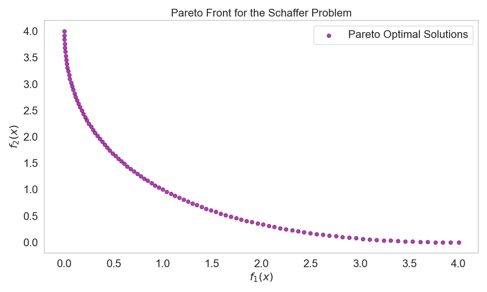
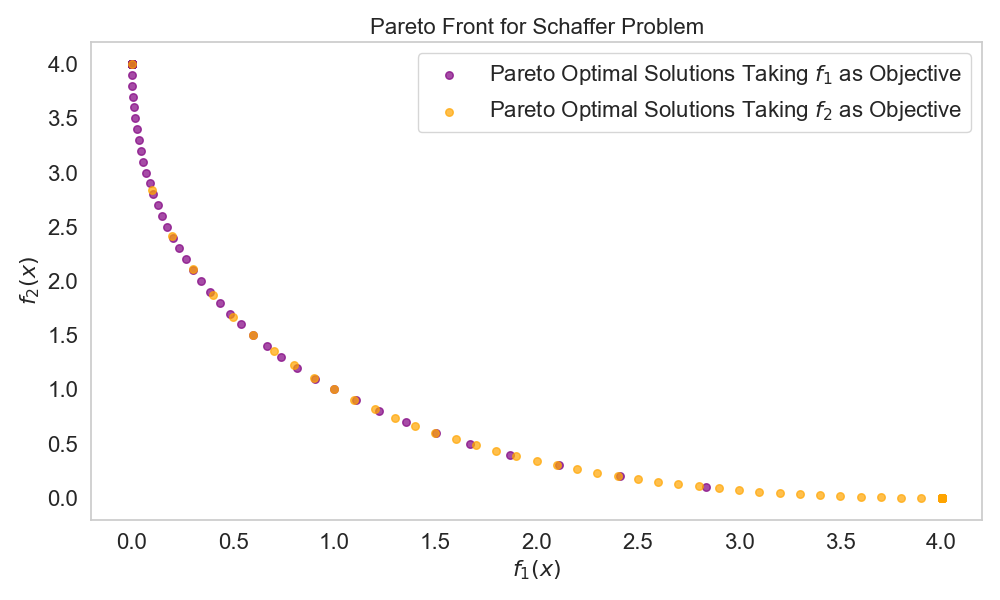
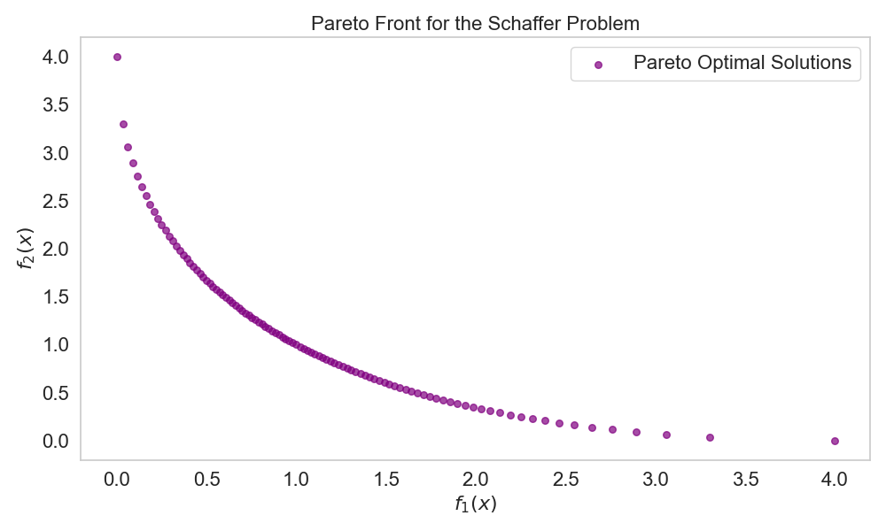

# Evaluation of Multiobjective Algorithms through the Schaffer Problem

**Author:** Amelia Hoyos Vélez  
**Optimization II, School of Applied Sciences and Engineering, EAFIT** 

## Abstract
*This article explores different multiobjective optimization techniques using the Schaffer problem as a case study. We implement methods like weighted sums, $\epsilon$-restriction, and the Min-Max method to see how well they balance conflicting goals while working within specific limits. By examining the Pareto optimal solutions, we highlight the effectiveness of these algorithms in making informed decisions.*

## Introduction
The Schaffer problem, proposed in [Schaffer1984](https://www.example.com) and given in the following equation, is a multiobjective optimization problem with two objective functions to minimize, $f_1(x)$ and $f_2(x)$, subject to a single constraint $-A\leq x\leq A$, with $A\in [10, 10^5]$.

$\min f(x) = \left(f_1(x) = x^2, f_2(x) = (x - 2)^2 \right)
\text{ s.t.} \quad -A \leq x \leq A \tag{1}$


The function $f_1(x)$ is minimized at $x = 0$ and the function $f_2(x)$ is minimized at $x = 2$, which implies that as we approach the optimum of one, we move away from the solution of the other. Therefore, there must exist a balance point between these two objectives.

The Schaffer problem is commonly used to evaluate multiobjective optimization algorithms due to its simplicity and the convexity of its Pareto front. Additionally, the problem presents a conflict between the objectives, making it ideal for testing various algorithms of this type. In this article, we will evaluate the solution of the problem using weighted sum methods, $\epsilon$-restriction, and the MinMax Method.

## Weighted Sums
According to [Schaffer1984](https://www.example.com), the Pareto-optimal solutions of $x$ for Eq. (1) are within the interval $0 \leq x \leq 2$, which guarantees that the constraint is always satisfied. This limitation, by establishing $x$ between $-A$ and $A$ with $A$ in the range from $10$ to $10^5$, prevents unbounded solutions. Thus, a reasonable search space is defined that allows optimization algorithms to explore efficiently without exceeding the limits, ensuring that the results are feasible and practical. However, we know from previous studies that the solution will be the same for any $A$ within the range. The following pseudocode, Algorithm 1, describes the Weighted Sums algorithm.

### Algorithm 1: Weighted Sums Algorithm
```plaintext
1. Define the value of A
2. Create an empty list to store Pareto optimal solutions
3. For each w in [0, 1] with a step of 0.01:
    1. Minimize w * f_1(x) + (1 - w) * f_2(x) subject to |x| <= A
    2. Store the solution x and evaluate f_1(x) and f_2(x)
    3. Add [x, f_1(x), f_2(x)] to the list of Pareto solutions
4. Plot the Pareto Front f_1(x) vs f_2(x)
```

Several tests were conducted for different values of $A$, and it was found that the Pareto front was the same across all instances. Note that in Figure 1, all solutions are on the interval $[0, 2]$ for both solutions, as previously stated. The solutions are well distributed across the entire Pareto front to account for all the different combinations of weights.



## $\epsilon$-Restriction
Now, the $\epsilon$-Restriction algorithm shown in Algorithm 2 was implemented, trying both functions as the objective functions, respectively.

### Algorithm 2: $\epsilon$-Restriction Method
```plaintext
1. Define the value of A
2. Define the objective function f_o
3. Define the restriction function f_k
4. Create an empty list to store Pareto optimal solutions
5. For each ε in [0, 10] with a step of 0.1:
    1. Minimize f_o(x) subject to:
        1. f_k(x) ≤ ε and |x| ≤ A
    2. Store the solution x and evaluate f_o(x) and f_k(x)
    3. Add [x, f_1(x), f_2(x)] to the list of Pareto solutions
6. Plot the Pareto front f_1(x) vs f_2(x)
```

Several values for $A$ were tested, and it was observed that changing the value did not alter the solutions on the Pareto front. This indicates that the value of $A$ is not critical for determining the optimal trade-offs between the objective functions. In Figure 2, several important observations can be made. First, the solutions lie within the theoretically specified interval, which confirms the correctness of the implementation. Additionally, when one function is selected as the objective, the optimal solutions tend to be more densely concentrated around the objective function’s optimal values. This occurs because the restriction imposed on the other function allows for more flexibility, enabling the algorithm to focus more on optimizing the chosen objective function.



## MinMax Method
The Min-Max method has also been implemented as presented in class and has been used to solve for the Pareto optimal solutions of multi-objective functions. This straightforward method effectively evaluates the performance of multi-objective optimization algorithms in the context of the Schaffer Problem. The Min-Max method is detailed in Algorithm 3.

### Algorithm 3: Min-Max Optimization Algorithm
```plaintext
1. Define the value of A
2. Define ideal values z_1^* = 0, z_2^* = 0 for both the objective functions.
3. Create an empty list to store Pareto optimal solutions
4. For each w in [0, 1] with a step of 0.01:
    1. Minimize D subject to:
        1. D ≥ w * (f_1(x) - z_1^*)
        2. D ≥ (1 - w) * (f_2(x) - z_2^*)
        3. |x| ≤ A
    2. Store the solution x and evaluate f_1(x) and f_2(x)
    3. Add [x, f_1(x), f_2(x)] to the list of Pareto solutions
5. Plot the Pareto Front f_1(x) vs f_2(x)
```

In Figure 3, the results for this method are presented. Several values of $A$ were tested, and it was observed that the Pareto front did not change. Additionally, it is important to note that the algorithm tends to produce denser solutions near the midpoint of the extremes on the plot. This behavior occurs because the Min-Max method aims to minimize the differences to a central value, effectively identifying an optimal balance between the two objective functions, even when they have different weights. As a result, the solutions tend to group toward this midpoint, suggesting that the optimal trade-off lies between the two functions.


